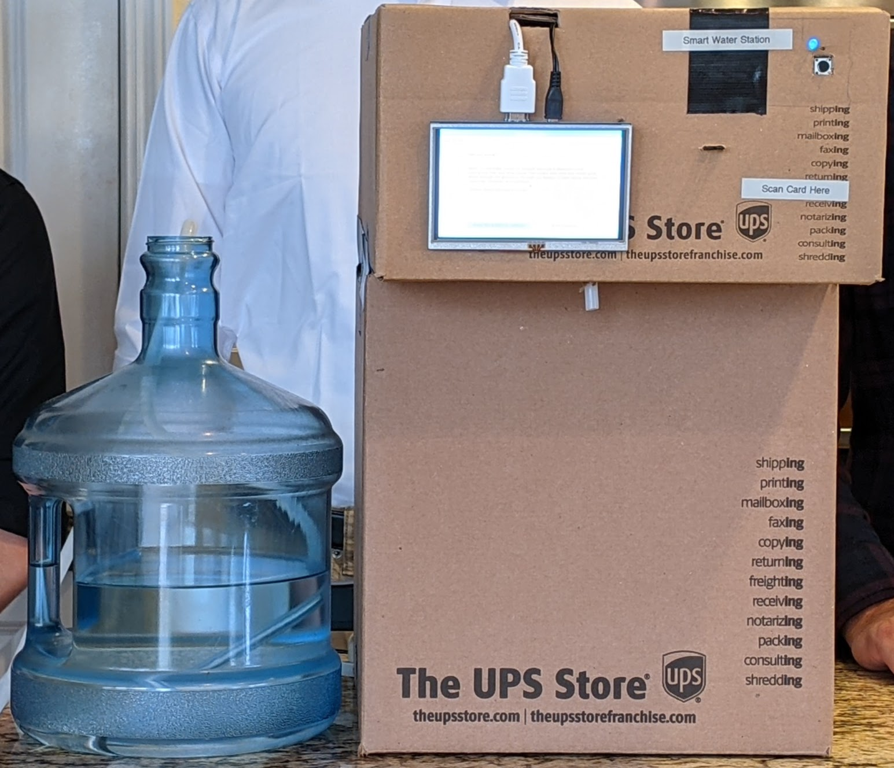

# CS179J Smart Water Station

### Motivation
- - -
This is a senior design project for CS179J (Computer Architecture and Embedded Systems) Summer 2021 at the University 
of California, Riverside.

The __Smart Water Station__ recommends and tracks the _daily hydration_ of a number of people, it also dispenses water! It 
does this through the use of three main subsystems:
- Graphical User Interface (GUI)
- RFID Sensor and Cards
- Water Pump / Dispenser

This project is brought to you by [Ken](https://github.com/klee229), [Ivann](https://github.com/idelc), and 
[Chris](https://github.com/chrisalexman).

### Demo
- - -
####Final Prototype (Front)
<!---  --->


[YouTube Demo](https://www.youtube.com/watch?v=06_9gGf-8D4)

### Hardware
- - -
#### GUI
- [5 inch 800x480 LCD](https://www.amazon.com/Elecrow-800x480-Interface-Supports-Raspberry/dp/B013JECYF2/ref=sr_1_2_sspa?dchild=1&keywords=raspberry+pi+lcd+display&qid=1624503115&sr=8-2-spons&psc=1&spLa=ZW5jcnlwdGVkUXVhbGlmaWVyPUFENVU1VVFNWVgyN0wmZW5jcnlwdGVkSWQ9QTA4ODI2NDE4RjUySUFaNEZLTjAmZW5jcnlwdGVkQWRJZD1BMDEwMjg2MDFWM1BBUlE2MEJKTEgmd2lkZ2V0TmFtZT1zcF9hdGYmYWN0aW9uPWNsaWNrUmVkaXJlY3QmZG9Ob3RMb2dDbGljaz10cnVl)
- [Mini Wireless Keyboard + Touchpad](https://www.amazon.com/Rii-Wireless-Keyboard-Lightweight-Controller/dp/B00I5SW8MC/ref=pd_ybh_a_3?_encoding=UTF8&psc=1&refRID=HGE6NWDM76S848DQTVDS)
- [HDMI Cable](https://www.canakit.com/hdmi-cable-6-feet.html)

#### RFID
- [RFID Sensor](https://www.adafruit.com/product/364)
- [RFID Cards](https://www.adafruit.com/product/359)

#### Water Pump
- [Diaphragm Water Pump](https://www.amazon.com/Gikfun-Aquarium-Diaphragm-Arduino-EK1912/dp/B07DW4WRV8/ref=pd_bxgy_img_2/138-1399923-0602057?pd_rd_w=J8eZO&pf_rd_p=c64372fa-c41c-422e-990d-9e034f73989b&pf_rd_r=ZRYRFTZEADK4NY2VQDX7&pd_rd_r=be2366bf-c297-4e56-98ae-61bacb351e65&pd_rd_wg=VxYsZ&pd_rd_i=B07DW4WRV8&psc=1)
- [Food Grade Silicon Tubing](https://www.amazon.com/gp/product/B07W5TGX8B/ref=ppx_yo_dt_b_asin_title_o00_s00?ie=UTF8&psc=1)
- [4 Channel DC 5V Relay](https://www.amazon.com/gp/product/B00KTEN3TM/ref=as_li_ss_tl?ie=UTF8&psc=1&linkCode=sl1&tag=alanconstanti-20&linkId=1a6a56b42aa40fddb229b6ea0ab3ce9b&language=en_US)

#### Other
- [Raspberry Pi 3 B+](https://www.canakit.com/raspberry-pi-3-model-b-plus.html)
- [Push Button](https://www.digikey.com/en/products/detail/te-connectivity-alcoswitch-switches/1825910-6/1632536) x1
- [Blue LED](https://www.digikey.com/en/products/detail/lumex-opto-components-inc/SSL-LX5093GD-5V/270898?s=N4IgTCBcDaIGwHYC0BGFAGdSByAREAugL5A) x1
- [330 Ohm Resistor](https://www.digikey.com/en/products/detail/stackpole-electronics-inc/CF14JT330R/1741399?s=N4IgTCBcDaIMIDECMAWAUgFQMxYAwCU4MBaAOQBEQBdAXyA) x1
- [Various Length Jumper Wires](https://www.digikey.com/en/products/detail/bud-industries/BC-32625/4156446?s=N4IgTCBcDaIMwHYEFowAYCcdkDkAiIAugL5A)

### Installation
- - -
#### Libraries
Here are the libraries needed to run the station from a Raspberry Pi.

Follow the tutorial [here](https://learn.adafruit.com/welcome-to-circuitpython/installing-circuitpython) to install CircuitPython on your Raspberry Pi.

Then follow the tutorial [here](https://github.com/adafruit/Adafruit_CircuitPython_PN532) to install the RFID sensor library called pn532.

#### LCD Screen
Follow the tutorial [here](https://elecrow.com/wiki/index.php?title=HDMI_Interface_5_Inch_800x480_TFT_Display) to format the LCD screen.

#### GUI Starts on Reboot
Open the terminal on your Raspberry Pi and run the following commands.

`sudo nano /etc/xdg/autostart/display.desktop`

Then enter the following into the new file created.
```
[Desktop Entry]

Name=CS179J-Smart-Water-Station

Exec=/usr/bin/python3 /home/pi/Documents/CS179J-Smart-Water-Station/gui/gui.py
```

#### Project Setup
Open the terminal on your Raspberry Pi and run the following commands.

To clone and enter into the repository.
```
git clone https://github.com/klee229/CS179J-Smart-Water-Station-Project.git
cd CS179J-Smart-Water-Station-Project
```
To run the setup bash script.
```
chmod +x setup.sh
./setup.sh
```
To reboot the Raspberry Pi.
```
sudo reboot
```

### Tests
- - -
There are two types of tests used in this project, both are in the `/tests` directory.
1. Unit Tests from the [Python unittest framework](https://docs.python.org/3/library/unittest.html).
2. Code to test a subsystem's hardware individually (GUI, RFID, Pump).
```
.
├── ...
├── tests                           # Test files
│   ├── test_button_input.py        # 2. Check dispense button is connected correctly
│   ├── test_csv.py                 # 1. Open, write, read, edit, add row to user data CSV file
│   ├── test_rfid_no_hardware.py    # 1. Set/Get uid, register, unregister, check registration
│   ├── test_rfid_scan_card.py      # 2. Scan and output RFID card unique identifier (uid)
│   └── test_timed_pump.py          # 2. Turn on pump for 5 seconds, check water output
└── ...
```


### How to Use
- - -
The Smart Water Station is meant to be placed on a flat and secure surface in an area where multiple people can use the 
product. Using the station is easy, here are the general steps:
1. Take out your RFID compatible card and walk up to the station.
2. Use the mini keyboard + touchpad to interact with the GUI.
3. Scan your RFID card to register or log into the station.
4. From the main page you can click the on-screen button to begin dispensing water.
5. Place your cup/bottle underneath the dispenser, push the physical button, and watch your water dispense!

### License
- - -
[MIT](https://choosealicense.com/licenses/mit/)
